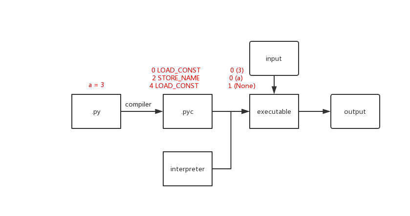
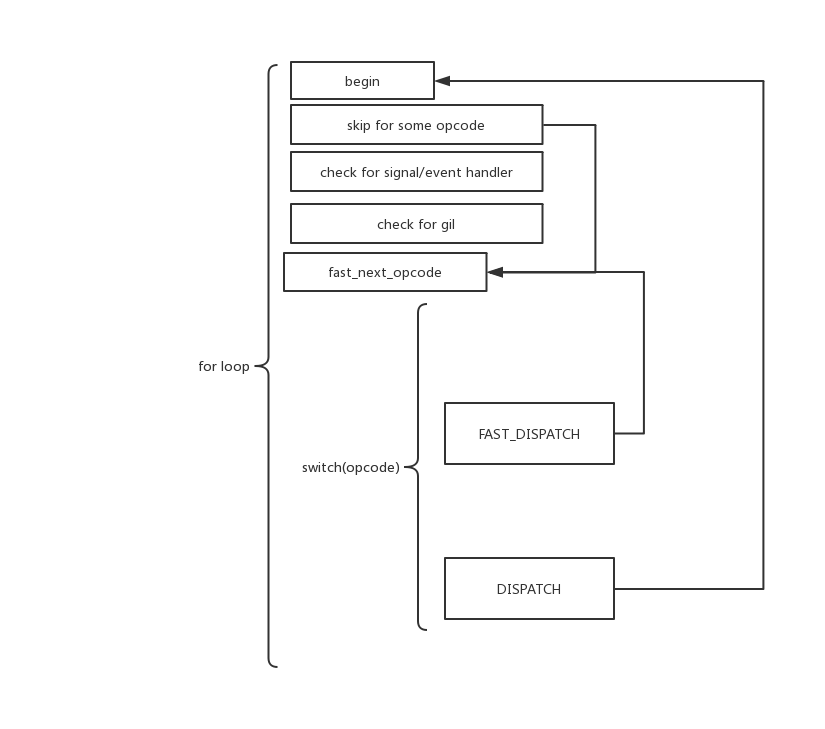
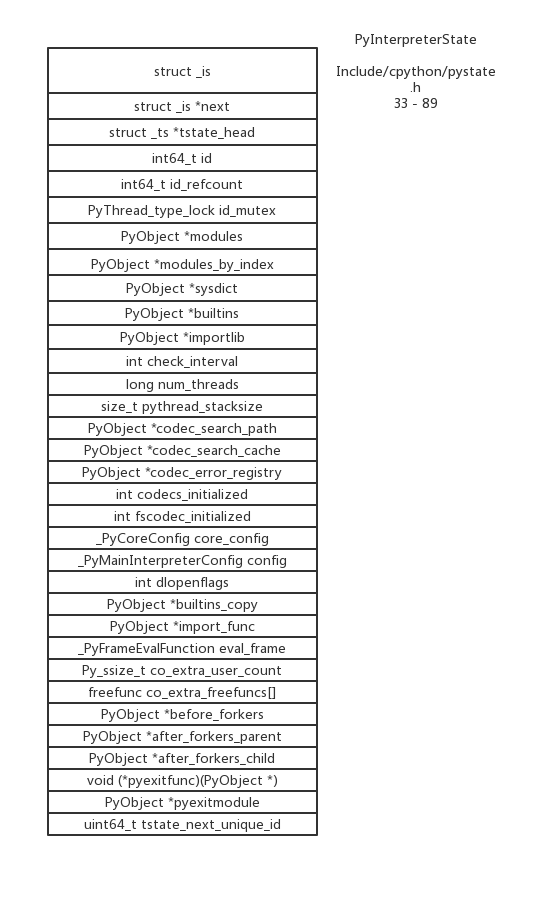
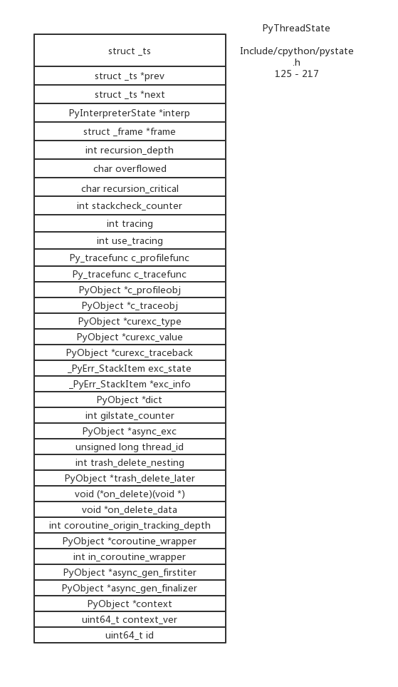
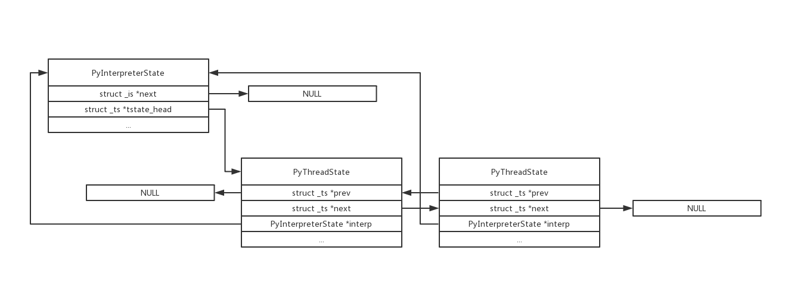

# python 解释器

# 目录

* [概述](#概述)
* [ceval](#ceval)
* [intepreter 和 thread](#intepreter-和-thread)
* [更多资料](#更多资料)


# 概述

python 解释器不仅仅是一个解释器, 它包括很多个部分

当你通过 `.py` 文件来执行一个 python 程序时, 编译的部分会把你写的源代码转换为一种叫做 python 字节码的形式, import 目录下的文件中的字节码会被缓存在 `pyc` 文件中, 解释器会开始 main loop 循环, 一个字节码一个字节码的读取, 并执行

这个 `pyc` 文件并不会提高你的程序运行速度, 它只会提高你程序的加载速度, 你只要没有修改过源代码文件, 则下次启动可以跳过生成 `pyc` 的部分, 仅此而已

根据 [pep-3147](https://www.python.org/dev/peps/pep-3147/) 所描述的, 在 python 版本 3.3 之后, `pyc` 文件只会在 `import` 机制下产生, 并且 `pyc` 文件会保存在 `__pycache__` 目录下



# ceval

main loop 循环主要定义在如下位置 `cpython/Python/ceval.c`

```c
main_loop:
    for (;;) {
    	// 必要情况下跳转到 fast_next_opcode
    	// 检查是否有 signal hndler/async io handler 需要处理
        // 检查是否需要释放 gil
		fast_next_opcode:
            switch (opcode) {
                /* ... */
            }
    }

```

我们可以画出流程



# intepreter 和 thread

这是 **PyInterpreterState** 的定义



这是 **PyThreadState** 的定义



如果我们当前有两个线程在运行中



# 更多资料
* [原文链接](https://github.com/zpoint/CPython-Internals/blob/master/Interpreter/pyobject/pyobject_cn.md)
* [pep-3147](https://www.python.org/dev/peps/pep-3147/)
* [Junnplus's blog: Python中的code对象](https://github.com/Junnplus/blog/issues/16)